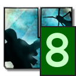

# Unvanquished Tray

[](https://pypi.org/project/unvtray/)
[](https://aur.archlinux.org/packages/unvtray)
[](https://github.com/psf/black)

<p align="center">
  
</p>

A minimalistic [Unvanquished](https://unvanquished.net/) server browser that
runs in your system tray. The icon shows the player count of the most populated
server. A left click on the icon connects to this server (on supported
platforms) while a right click opens a server list in a context menu. Clicking
on a server will launch the game and connect to it.

## Installation

#### via pip

```shell
pip install --user unvtray
```

#### on Arch Linux

```shell
$YOUR_AUR_HELPER -S unvtray
```

#### from source

```
git clone https://github.com/Unvanquished/unvanquished-tray-browser.git
cd unvanquished-tray-browser
python -m pip install --user build  # possibly already installed
python -m build
python -m pip install --user dist/*.whl
```

## Running

To run Unvanquished Tray in the foreground, execute:

```
unvtray
```

or, if the above does not work (e.g. when `~/.local/bin` is not in your `PATH`
on Unix-like platforms):

```
python -m unvtray
```

### Autostart

#### on GNU/Linux

To either of the above commands, append `&` as necessary (for running in the
background) and add it to your display server startup file (e.g. `~/.xinitrc`
if starting Xorg manually or `~/.xprofile` if using a display manager), or to
your desktop environment or window manager configuration (e.g. `.i3/config` for
i3). See the [Arch Linux
wiki](https://wiki.archlinux.org/title/autostarting#On_Xorg_startup) for more
options.

## Troubleshooting

### The game does not launch when selecting a server from the context menu

#### on GNU/Linux

Make sure `xdg-utils` are installed and that your distribution of Unvanquished
comes with a `.desktop` file that describes the `unv://` URI scheme. For
example, the [official
updater](https://github.com/Unvanquished/updater/releases/) and the [official
flatpak](https://flathub.org/apps/details/net.unvanquished.Unvanquished) (all
platforms) as well as the [AUR
package](https://aur.archlinux.org/packages/unvanquished) (Arch Linux) should
install a `.desktop` file alongside the game.

#### on other platforms

Launching the game may not be implemented properly for other platforms; please
comment in Unvanquished/unvanquished-tray-browser#2 if you are affected.

### Launching the game on a different monitor than the tray icon is on

#### using i3

Add the following to your configuration:

```
for_window [class="daemon"] move container to output YOUR_MAIN_MONITOR
```

Additionally, for i3 it is recommended to disable _fullscreen_ and enable
_borderless window_ in the game's settings and to add the following to your
configuration:

```
for_window [class="daemon"] fullscreen
```

A similar solution may improve fullscreen behavior also with other tiling
window managers.

## Code and asset licenses

- The source code is licensed under [GPLv3 or later](LICENSE.txt).

- The [included font](unvtray/assets/FreeMonoBold.otf) is unmodified from the
  [GNU FreeFont family](https://www.gnu.org/software/freefont/) and is licensed
  under [GPLv3 or later](LICENSE.txt).

- The original [Unvanquished icon](unvtray/assets/unvanquished.png) and the
  derived [unvtray icons](package/icons) are licensed under [CC BY-SA
  2.5](https://creativecommons.org/licenses/by-sa/2.5/); you may attribute all
  to "Unvanquished Development."
