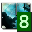

# Unvanquished Tray



A minimalistic Unvanquished server browser that runs in your tray. The icon
shows the player count of the most populated server. A left click on the icon
connects to this server (on supported platforms) while a right click opens a
server list in a context menu.

## Installation

Via pip:

```shell
pip install --user unvtray
```

## Running

To run Unvanquished Tray in the foreground, execute:

```
unvtray
```

or, if the above does not work (e.g. when `~/.local/bin` is not in your `PATH`):

```
python -m unvtray
```

To start it with your window manager, append ` &` as necessary (for running in
the background) and add the command to your startup file (e.g. `.xinitrc`).

## Troubleshooting

### Left click on the icon does not launch the game

On GNU/Linux, this is a limitation of the `pystray` library's default backend;
use the context menu (right click) to connect.

### The game does not launch even when selecting a server from the context menu

#### GNU/Linux

Make sure `xdg-utils` are installed and that your distribution of Unvanquished
comes with a `.desktop` file that describes the `unv://` URI scheme.

### Launching the game on a different monitor than the tray icon is on

The solution depends on your platform and window manager.

#### i3

Add the following to your configuration:

```
for_window [class="daemon"] move container to output YOUR_MAIN_MONITOR
```

Additionally, for i3 and possibly other tiling window managers it is
recommended to disable _fullscreen_ and enable _borderless window_ in the
game's settings and to add the following to your configuration:

```
for_window [class="daemon"] fullscreen
```
